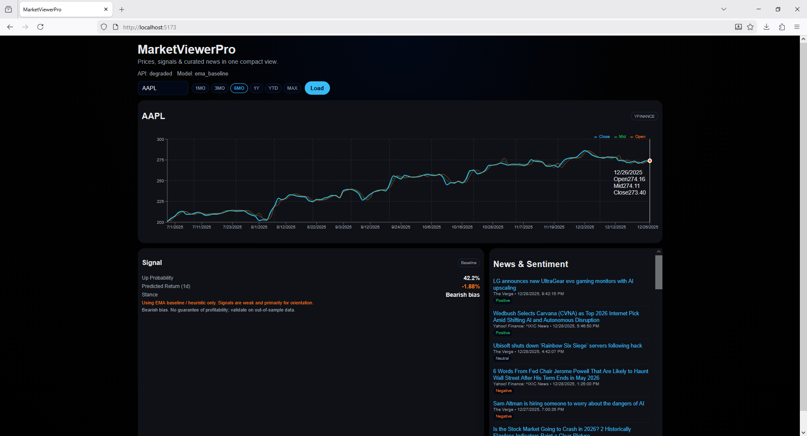

Stack: FastAPI (backend) + React/Vite (frontend) + Recharts (charts) + yfinance (data)

Status: MVP working. Stable endpoints. Conservative signals. Good enough to iterate.

# What v1 does

Prices + indicators

OHLCV with SMA/EMA/RSI, volume change, price/MA ratios. Caching + multiple data sources. If a provider hiccups, it returns last good data marked as stale: true.

Signals (baseline + RF v1)

Next-day direction probability + tiny return estimate. Falls back to an honest EMA baseline if the model isn’t available or data is weird. Treat as research/paper trading only. All practice, not to be treated as financial advice.

News + sentiment

Curated RSS feeds, VADER sentiment, relevance boosted by ticker mentions. Filters by ticker, source, and min sentiment.

Observability

/api/health and /api/metrics to check model and data status.

Quickstart

I run backend + frontend in two terminals. Windows commands shown (adjust for macOS/Linux).

# Backend (FastAPI)

cd backend

python -m venv venv

. venv/Scripts/activate

pip install -r requirements.txt

optional: copy .env.example to .env (see below)

uvicorn app.main:app --reload

API: http://127.0.0.1:8000

Docs: http://127.0.0.1:8000/docs

# Frontend (React + Vite)

cd frontend

npm install

npm run dev

App: http://localhost:5173

API cheat-sheet

GET /api/health → service + provider status

GET /api/metrics → model metadata (name, last_trained_at, samples_used, etc.)

GET /api/price?ticker=AAPL&range=6mo&interval=1d → OHLCV + indicators + {stale, source}

GET /api/predict?ticker=AAPL → conservative next-day signal (RF v1 or EMA baseline)

GET /api/news?ticker=AAPL&limit=30&min_sentiment=-0.2&source=Reuters → curated news

Errors are structured. Common ones:

{"code":"no_data"} → bad/unknown ticker (returns 404)

{"code":"upstream_failed"} → data providers down (returns 502)

# Training Model

cd backend

venv\Scripts\activate

python train_models.py --tickers SPY,AAPL,MSFT,NVDA,AVGO,META,GOOGL,AMZN,TSLA --period 5y

This writes models/*.joblib (gitignored).

Restart the API after training:

uvicorn app.main:app --reload

# License / disclaimer

No license yet, assume private use.

This is not financial advice. Signals are experimental and for research/paper trading only.

# Thank you for using MarketViewerPro!
